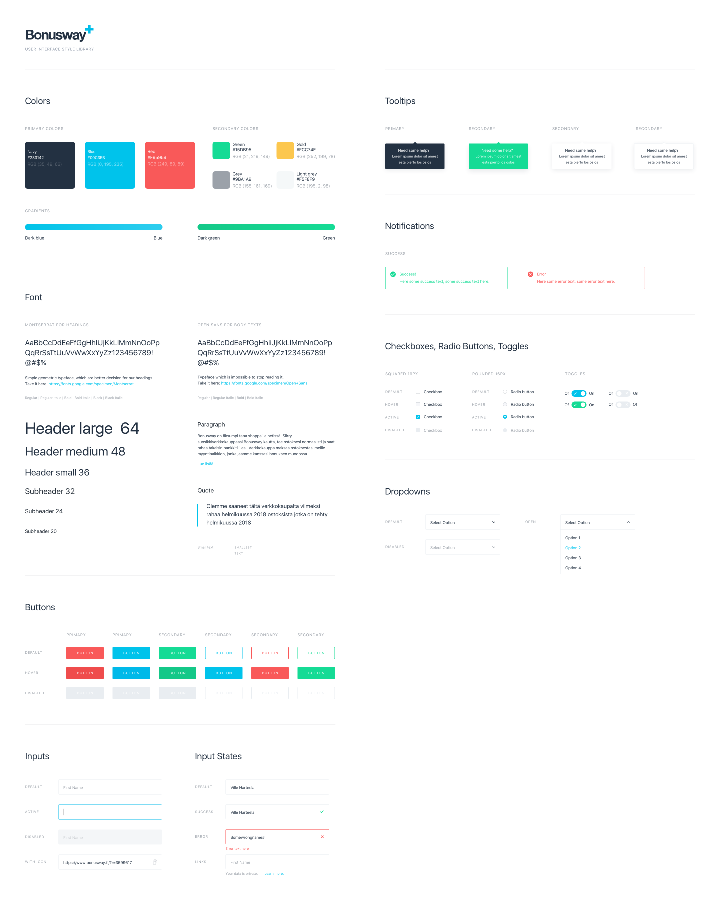

## Principles

Build a modern UI library that cares about:

	- responsive
		- suitable for all countries (widths, different languages etc)
		- fluid layout
		- media queries (adaptive/desktop-first)
		- relative units

	- maintainable, scalable, reliable
		- guidance
		- architecture
		- reusable
		- growth
		- naming
		- clean code
		- autoprefixer
	
	- performance
		- only built what we need
		- less redundant vendors
		- less images (build process, base64 for small images)
		- uglify


##  Architecture 

- folder/file naming prefer plural
- partial file start with _
- be aware of the cascading order when import the partial files

```
sass/
|
|– base/
|   |– _variables.scss   # Independent variables
|   |– _helpers.scss     # Independent Functions & Mixins
|   |– _index.scss       # Main scss rules
|
|– atoms/
|   |– colors
|   |– typography
|   |– icons
|   |– buttons
|   ...                  # TODO
|
|– molecules/
|   ...                  # TODO
|
|– organisms/
|   ...                  # TODO…
|
|– vendors/
|   |– fonts
|   |– grid
|
|
`– main.scss             # Main sass entry file
```

## Demo

Please check the `index.html` page in the repo. (not responsive, please check via desktop)

## CSS guidelines

[Airbnb](https://github.com/airbnb/css)

## naming convention
- [BEM](http://getbem.com/) (`.block__element-name--modifier`)
- no camelcase AT ALL!

For example:

	```
	<div class="color-box bg grey--dark">grey--dark</div>
	<div class="color-box bg light-grey--dark">light-grey--dark</div>
	<input class="form__input--lg">
	```

## desktop first adaptive design

- start writing css for desktop: large screen
- then shrink design to smaller screen
	@media(max-width: 600px)
- max-width media queries


## Buttons

To use buttons, you need to specify background color AND text color e.g. 'class="btn white bg--blue"', this will enable the darken background feature. But if you want to customize the `on-hover` state, you can simply do: `on-hover-bg--red` to change the background or `on-hover--red` to change the text.

## Breakpoints

Based on the data [here](http://gs.statcounter.com/screen-resolution-stats) as well as our own data, we would go with the following breakpoints.

	```
	< 600px phone
    600px - 900px  tablet portrait
    900px - 1200px tablet landscape
    1200px - 1800px desktop
    1800px - big desktop
	```

## Development guides

### DRY
	
- use mixins, functions or create helper for general problems (Ref: `abstracts/_minxins.scss`)

### Use Colors properly

 - Please always use `color($color-name, $color-variations)` to get the correct color, available colors and variations are available at `abstracts/_abstracts.scss`.
 - use `colorfy($property-name)` to support color variations for different elements, such as: `class="bg navy-light"`, Ref: `base/_utilities.scss`.
 - color name in class without prefix refers to change `color` property, others, specify `.bg--navy`.


## Project status checklist

> "marked" means both design and implementation are done.

- [x] Archetecture
- [x] Guidelines
- [x] Grid system (http://gridlex.devlint.fr/)
- [x] Icon system
- [x] Color palette
- [ ] Typography
- [ ] Card
- [ ] Alert
- [ ] Button
- [ ] Form
- [ ] Utility
- [ ] Animations

## TODO
- color background activator


## Designs

